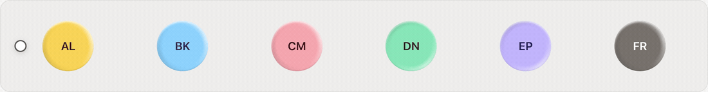

<div align="center">


# @exegia/specular

Pointer-following rim highlights and inset bezel utilities for Tailwind v4 + React.

[npm](https://www.npmjs.com/package/@exegia/specular) · [live examples](https://emmanuel-defreitas.github.io/specular/) · [MIT](LICENSE)

<a href="https://emmanuel-defreitas.github.io/specular/">
  
</a>

<sub>Six discs, one window listener. Explore the interactive presentation on the <a href="https://emmanuel-defreitas.github.io/specular/">example site</a>.</sub>

</div>

---

## Install

```bash
bun add @exegia/specular
```

All entry points below are included in this one package. The package declares Tailwind CSS **4.1–4.x** as a peer dependency and Node.js **22.18+** as its engine. Set up Tailwind in your app before using the generated utility classes.

Install these optional peers only for the features you use, if your app does not already have them:

```bash
# For @exegia/specular/react
bun add react@^19

# For @exegia/specular/merge
bun add tailwind-merge@^3
```

## Setup

Choose the effect you want; you do not need every entry point.

| I want to… | What to set up |
| --- | --- |
| Add inset highlights/shadows with classes such as `bezel-base` | Define surfaces and register the Tailwind plugin: steps 1–3 below. React is not required. |
| Merge Specular classes in a `cn()` helper | Also pass the same surfaces to `createCn`: step 4. |
| Put a rim overlay on an avatar or image | Use `<Rim>` from `/react`. No surface config or Specular plugin is required. See [React effects](#exegiaspecularreact--react-effects). |
| Make a rim follow the pointer | Combine `usePointerLight(ref)` with `<Rim angle={angle}>`. |
| Make an inset bezel follow the pointer | Combine the Tailwind setup with `usePointerLight` and `litVars`. |

### 1. Define your surfaces

A **surface** is a named collection of shadow layers. Its name becomes the utility prefix: `bezel` below creates `bezel-*` classes. This is your app's configuration; Specular does not ship a default surface preset.

Create these two files at your project root:

```ts
// specular.config.ts
import { defineSurfaces } from "@exegia/specular"

export const surfaces = defineSurfaces({
  bezel: {
    layers: {
      lit: { color: "#fff", y: 2, blur: 3, alpha: 80, dark: { y: 1, blur: 1, alpha: 5 } },
      dim: { color: "#000", y: -1, blur: 2, alpha: 15, dark: { y: -8, alpha: 20 } },
    },
  },
})
```

```ts
// specular.plugin.ts
import { createPlugin } from "@exegia/specular/plugin"
import { surfaces } from "./specular.config.ts"

export default createPlugin(surfaces)
```

`defineSurfaces` validates the names and preserves TypeScript types. It does not generate CSS. `createPlugin` turns that configuration into Tailwind utilities.

### 2. Register the plugin in your CSS

In your app's Tailwind stylesheet:

```css
/* src/app.css */
@import "tailwindcss";
@plugin "../specular.plugin.ts";
```

The plugin path is relative to this CSS file. Make sure your app loads this stylesheet.

**Register your local plugin file, not `@plugin "@exegia/specular/plugin"`.** The package exports a factory that needs your `surfaces`; the local file calls it and exports the configured plugin. There is no additional Specular stylesheet to import.

### 3. Use the generated classes

```tsx
<button className="rounded-lg bg-stone-200 px-4 py-2 bezel-base active:bezel-lit/20 active:bezel-dim/40">
  Press me
</button>
```

`bezel-base` applies all configured layers. Utilities let you change individual properties:

| Class | Effect |
| --- | --- |
| `bezel-lit/60` | Set the `lit` layer's alpha to 60%. |
| `bezel-lit-t-2` | Light the top edge with a 2px inset offset. |
| `bezel-dim-b-1` | Set a 1px offset from the bottom edge. |
| `bezel-lit-blur-4` | Set the `lit` layer's blur to 4px. |
| `bezel-spread-1` | Set every layer's spread to 1px. |

Each modifier utility also applies the surface's full shadow, so `bezel-base` is useful for the preset but is not required alongside a modifier. Bare layer classes such as `bezel-lit` keep the configured alpha.

The `dark` values activate under a `.dark` ancestor by default, for example `<html class="dark">`. Your app controls that class. Change a surface's `darkSelector` to use another selector or `@media (prefers-color-scheme: dark)`.

### 4. Optional: configure `cn()`

Use this if you merge dynamic classes with tailwind-merge. Static `className` strings do not need it.

```ts
// src/lib/cn.ts
import { createCn } from "@exegia/specular/merge"
import { surfaces } from "../../specular.config.ts"

export const cn = createCn(surfaces)
```

```tsx
<button className={cn("bezel-base bezel-lit/60", pressed && "bezel-lit/20")}>
  Press me
</button>
```

**`createCn(surfaces)` requires your surface config.** There is no zero-argument default or separate options object. Create the helper once, using the same config as the plugin, then call `cn(...)` throughout your app. It merges normal Tailwind classes as well as Specular classes.

## Exports, by purpose

### `@exegia/specular` — shared configuration and inline styles

| Export | What it provides |
| --- | --- |
| `defineSurfaces(config)` | Validates your surface/layer names and returns the typed config shared by the plugin and merge helper. |
| `litVars(angle, depth?, surface?)` | Returns inline CSS variables that turn a surface's `lit` layer toward an angle. Defaults: depth `2.5` pixels, surface name `"card"`. |
| `Surfaces`, `SurfaceConfig`, `LayerConfig`, `Length`, `LitVars` | Types for configuration and inline styles. |

Layer settings are optional: inset defaults to `true`, color to white for the first layer and black for later layers, offsets/blur/spread to `0`, and alpha to `100` (percent). Supply offsets or blur to make an inset layer visible. The base class defaults to `<surface>-base`.

For a pointer-following **inset bezel**, use the configured surface name and a layer named `lit`:

```tsx
"use client"

import { useRef } from "react"
import { litVars } from "@exegia/specular"
import { usePointerLight } from "@exegia/specular/react"

export function LitButton() {
  const ref = useRef<HTMLButtonElement>(null)
  const angle = usePointerLight(ref)

  return (
    <button
      ref={ref}
      className="rounded-lg bg-stone-200 px-4 py-2 bezel-base"
      style={litVars(angle, 2.5, "bezel")}
    >
      Move your pointer
    </button>
  )
}
```

This uses the Tailwind plugin but does not need `<Rim>`.

### `@exegia/specular/plugin` — generate Tailwind CSS

`createPlugin(surfaces, options?)` is the build-time factory used in setup step 1. It generates the surface utilities and dark-mode presets. It does not handle pointer movement or class merging, and it does not require React.

The `surfaces` argument is required; the second argument is optional. By default, the plugin also supplies `<Rim>` dark-mode tokens under `.dark`: `hi: 0.18`, `lo: 0.4`. You can customize those independently of your surfaces:

```ts
export default createPlugin(surfaces, {
  rim: { darkSelector: ".dark", dark: { hi: 0.18, lo: 0.4 } },
})
```

Use `{ rim: false }` to omit those tokens. `PluginOptions` and `RimTokens` are available as types.

### `@exegia/specular/merge` — merge class names correctly

| Export | When to use it |
| --- | --- |
| `createCn(surfaces)` | You want a ready-to-use `cn(...)` function that understands the configured utilities and their conflicts. |
| `mergeConfig(surfaces)` | You already customize tailwind-merge and want to incorporate Specular's class groups into that setup. Returns configuration, not a merging function. |

Both require the same surfaces passed to the plugin. They do not generate CSS or register the plugin. `createCn` accepts strings, arrays, and falsy values; it does **not** accept clsx-style objects.

The lower-level equivalent is:

```ts
import { extendTailwindMerge } from "tailwind-merge"
import { mergeConfig } from "@exegia/specular/merge"
import { surfaces } from "./specular.config.ts"

export const cn = extendTailwindMerge(mergeConfig(surfaces))
```

If your existing helper uses `clsx`, pass its output to this configured merger. `BezelGroupId` and `BezelMergeConfig` are available as types.

### `@exegia/specular/react` — React effects

**`<Rim>` draws the effect; `usePointerLight` provides movement.** They are independent: a rim can stay still, and the hook can drive a bezel or your own styles.

| Export | What it provides | Required setup |
| --- | --- | --- |
| `<Rim>` | A decorative gradient overlay, useful above images that would cover an inset shadow. Defaults to angle `0`. | A positioned parent and a border radius on the rim. |
| `usePointerLight(ref, options?)` | The pointer's angle around the referenced element, in degrees clockwise from the top. Renders nothing. | Attach the ref to the element you want to light. Options are optional. |
| `useRimTone(src, enabled?)` | Measures image-edge brightness as React state (`0`–`1`, or `null` while unavailable). | An image URL; enabled by default. |
| `measureRimTone(src)` | The same image measurement as a promise, for manual use instead of the hook. | Browser image/canvas support. |
| `toneToAlphas(tone, ends?)` | Converts brightness to `{ hi, lo }` props for `<Rim>`. | A numeric tone; custom endpoints are optional. |
| `useReducedMotion()` | Tracks the user's reduced-motion preference for your own effects. | No arguments. Already used internally by the pointer hook and rim. |

#### A pointer-following rim

This example needs React 19 and ordinary Tailwind utilities, but **no Specular plugin, surfaces, or `cn()` setup**:

```tsx
"use client"

import { useRef } from "react"
import { Rim, usePointerLight } from "@exegia/specular/react"

export function Orb() {
  const ref = useRef<HTMLDivElement>(null)
  const angle = usePointerLight(ref)

  return (
    <div ref={ref} className="relative size-20 rounded-full bg-stone-300">
      <Rim angle={angle} className="rounded-full" />
    </div>
  )
}
```

For a static rim, omit the ref and hook and render `<Rim className="rounded-full" />`. The component positions itself absolutely; the parent needs `position: relative`. Its effect uses inline styles, so you can also supply sizing, background, and border radius with your own CSS instead of Tailwind.

`<Rim>` accepts `hi` and `lo` strength overrides from `0` to `1`. Without overrides, it reads `--rim-hi-a` and `--rim-lo-a`, falling back to `1` and `0.2`. The Specular plugin supplies dark-mode values; without it, set the CSS variables or props yourself if you want theme-specific strengths.

`usePointerLight(ref, { damping: 0.4 })` makes tracking more gradual; the default is `1`. Set `enabled: false` to stop tracking. For custom CSS effects, `{ mode: "var" }` writes `--light-angle` on the referenced element instead of returning an angle or rerendering on pointer changes; `property` can override that variable name. The hook stops subscribing under reduced motion, and `<Rim>` disables its rotation transition.

In apps with React Server Components, put components that call these hooks in a `"use client"` file, as shown above.

#### Optional: adapt a rim to an image

Tone helpers adjust highlight/shadow strength to the image's brightness. They are not required for pointer tracking or for `<Rim>` to render.

```tsx
"use client"

import { useRef } from "react"
import { Rim, toneToAlphas, usePointerLight, useRimTone } from "@exegia/specular/react"

export function LitAvatar({ src, alt }: { src: string; alt: string }) {
  const ref = useRef<HTMLDivElement>(null)
  const angle = usePointerLight(ref)
  const tone = useRimTone(src)
  const alphas = tone === null ? {} : toneToAlphas(tone)

  return (
    <div ref={ref} className="relative size-20 rounded-full">
      
      <Rim angle={angle} {...alphas} className="rounded-full" />
    </div>
  )
}
```

`useRimTone` wraps `measureRimTone`; choose one, not both. Measurement returns `null` if the image cannot be sampled, including when a remote host does not allow CORS. The image can still display, and this example keeps the rim's default strengths until a tone is available.

`toneToAlphas` defaults to `{ hi: 0.7, lo: 0.6 }` for a black image edge and `{ hi: 1, lo: 0.2 }` for a white edge, interpolating between them. These explicit props override the rim's theme tokens.

The React entry point also exports `PointerLightOptions`, `RimProps`, `ToneAlphas`, and `ToneEnds` types, plus `ANGLE_EPSILON`, `RIM_TRANSITION`, and `DEFAULT_TONE_ENDS` constants for advanced use.

## Development

```bash
make ci
make example-dev
```

The [example site](examples/vite-react) is the complete visual reference.
